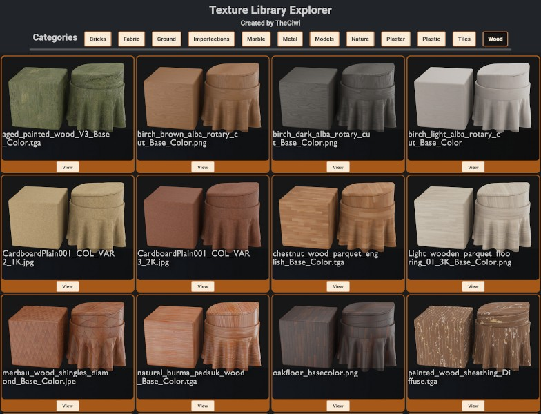

# **TEXTURE LIBRARY RENDERER**

 
 

This program was created out of a problem I had of not being able to easily view texture maps I accumulated over time. 
The number of assets had increased to the point I didn't know what I had that I would end 
up purchasing a texture asset I already owned because I was too lazy to check for it in my library.  
The solution I came up with was to automate the rendering process of all the textures then create html files with the renders arranged 
according to categories that I can browse easily, I also automated a large part of this (more details below). 
I had absolutely no idea how I was going to pull it off, I used C++ for no reason except that's what I am familiar with, I am currently still a C++ beginner though.  
I hope this program will also be useful to others with a same or similar challenge, 
It is licensed under the MIT License. 

In order to use the program in your own system you can take a look at the code and comments. 
It is best when your own texture assets library is arranged in folders and categories in a manner similar to the image below, which shows how the asset *Marble10* has been filed. 
You will also notice the texture map names are named according to conventional methods. I added to my code most of the conventional texture map names that are used in the 3D industry. 
If some are missing or you have some that are named in a non common way, you can add them to the program code yourself.  

   

Just to note; if everything compiles correctly you should see seven new files added to the main folder. 

   

I've unnecessarily tried to over comment so that even those that aren't well versed with C++ syntax can know what's going on, 
but I haven't explained absolutely everything with comments though. 
I wrote and compiled the source code in Visual Studio 2022 in a Windows 10 system with MSVC using the C++17 language standard.  
For compiling with g++ or to use the source code without using Visual Studio you can check this article : 
https://www.learncpp.com/cpp-tutorial/configuring-your-compiler-choosing-a-language-standard/  
 
The filesystem module may not work with g++ (in Linux or Windows) but there's some solutions on these articles:  
https://stackoverflow.com/questions/45867379/why-does-gcc-not-seem-to-have-the-filesystem-standard-library/45867491#45867491  
 
https://stackoverflow.com/questions/59879414/how-can-i-use-stdfilesystem-with-mingw32-make-and-msys2-on-windows   
However, there may be some more incompatibilities with g++ on Linux that I'm not aware of. 
   

## **Texture Library Explorer (not in this repo)**
 
The texture library explorer I created looks like this 

   

When you click on *view* a modal pops up with a closer look and the path to the asset as the title 

   

It was built using Bootstrap 5 and some basic CSS, I automated a lot of it since the library was too big to code entirely manually. 
The code for the library explorer is very specific to what I needed so I don't intend on adding it to my Github but 
if you're interested in the code just let me know (one way is to send a message on the issues part of this repo)  

## **Overview of my logic building this program (no need to read on!)**

 
This section serves as a record for me to know exactly what I was thinking when I reference this in the future.  

I required the program to recursively iterate through the relevant folders that contained the texture map assets and then save the results to .txt files,  
those .txt files will serve as logs and lists that the rest of the program will use to search for texture maps for rendering, use as a watermark label for the renders and keeping check of what is rendered.  
Since I knew I had some folders I didn't want included, I passed each iteration result through a function that would only let it pass if the folder had a normal map, as seen in  
the function SearchNormal from line 196 of the source code. 
On my personal program I had to add more `KeywordCheckxx` variables to exclude folders that had normal maps but I didn't want them rendered out. 
I also had to do the same on the `SearchAlbedo()` function, your individual case needs will vary so you may find 
you will have to add or remove `KeywordCheckxx` variables with associated if statements  
The last requirement was for the program to create a python automation script that Blender would use to load the texture maps on to a material, 
load a .txt file with the name of the current asset being rendered (this file will be used as  a watermark for the rendered image),  
then save the rendered image with the name from the watermark. 
Then I also needed a .bat file that would handle the execution and exit of the Blender and python script file on each loop. This .bat file would run Blender in background mode. 
Though obvious, I think I should mention each time the while loop runs, the python script, watermark text file and batch file are all being overwritten. 
I have read a lot on why `std::system()` shouldn't be used but I didn't have the time to figure out a better alternative to run Blender from within my program. 
After all was done, I had to create a separate program that would create a texture library explorer/browser that I could easily view the assets I had  
and browse by category instead of searching through about 500 different renders. 
This one ended up being harder than I thought and needed some manual fixing after automating the process. 

  

